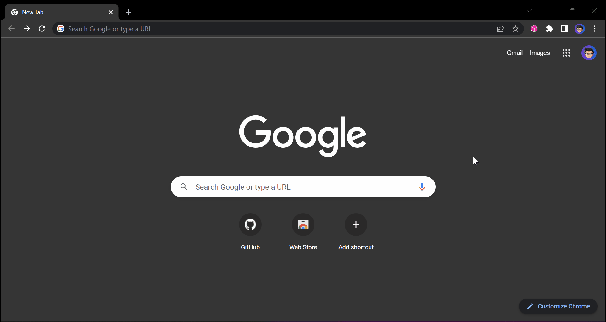

# IPFS Support Extension 

   

Adding standalone IPFS native URL support for chromium based browsers without installing IPFS in your machine. 📦🌐🧩

## 😅 Motivation

I build this extension because I'm lazy for real. I'm dealing with IPFS a lot in my work [@thirdweb](https://thirdweb.com) and I'm lazy to modify the IPFS native URL every single time just to make it work in Google Chrome. I don't wanna use IPFS companion because it requires you to install and run IPFS locally before you are able to use it just to make it support IPFS native URL in your browser. Told you, I'm lazy and I wanna accomplish my tasks quickly as possible. 😅

## 🤔 How It Works

It checks your tab if you input IPFS native url (e.g. `ipfs://`) and then it modifies it and convert into IPFS public gateway URL so you can view the IPFS contents in any normal browser. Nothing fancy technology here, I'm just a lazy developer who likes making things easier.

Currently it depends on google search engine URL parameters and modify it accordingly.

## ✨ Features

- IPFS Gateway URL
  - `gateway.ipfscdn.io/ipfs/` (Default)
- Supported Browser
  - Google Chrome with Google Search Engine (Default)
  - Microsoft Edge with Google Search Engine (Not Tested)

## 🐛 Issues

If you're facing a problem in using the IPFS Support Extension please let me know by [creating an issue here](https://github.com/warengonzaga/ipfs-support-extension/issues/new). I'm here to help you!

## 📋 Code of Conduct

Read the project's [code of conduct](./code_of_conduct.md).

## 📃 License

The IPFS Support Extension is licensed under [GNU General Public License v3](https://opensource.org/licenses/GPL-3.0).

## 🍀 Sponsor

> Love what I do? Send me some [love](https://github.com/sponsors/warengonzaga) or [coffee](https://buymeacoff.ee/warengonzaga)!? 💖☕
>
> Can't send love or coffees? 😥 Nominate me for a **[GitHub Star](https://stars.github.com/nominate)** instead!
> Your support will help me to continue working on open-source projects like this. 🙏😇

## 📝 Author

The IPFS Support Extension is developed and maintained by **[Waren Gonzaga](https://github.com/warengonzaga)**, with the help of awesome [contributors](https://github.com/warengonzaga/ipfs-support-extension/graphs/contributors).

---

💻💖☕ by [Waren Gonzaga](https://warengonzaga.com) | [He is Awesome](https://www.youtube.com/watch?v=HHrxS4diLew&t=44s) 🙏
